# 🛡️ CloudGuard Sentinel: Industrial MLOps Platform

**CloudGuard Sentinel** is an end-to-end MLOps platform designed for **Predictive Maintenance** in manufacturing. It predicts machine failures before they happen, preventing costly downtime.

Unlike typical "notebook" projects, this is a **production-grade platform** built with **GitOps** principles, **Infrastructure as Code**, and **Automated Model Governance**.

---

## 🏗️ High-Level Architecture

```mermaid
flowchart TD
    subgraph Dev["👩‍💻 Developer Workstation"]
        Push["git push"]
    end

    subgraph CI["⚙️ CI Pipeline — GitHub Actions"]
        Lint["Lint + Unit Tests"]
        Scan["Trivy Security Scan"]
        Build["Build & Push Docker Image"]
    end

    subgraph Feeders["CD Layer"]
        GHCR["📦 GHCR<br/>Container Registry"]
        TF["🏗️ Terraform<br/>Provisions EKS, VPC, IAM, S3"]
        Argo["🔄 ArgoCD<br/>Syncs K8s Manifests from Git"]
    end

    subgraph EKS["☸️ AWS EKS Cluster"]
        Monitor["📈 Prometheus + Grafana"]
        API["🚀 FastAPI Inference API"]
        Training["⚡ Argo Workflows ML Training"]
        MLflow["📊 MLflow Model Registry"]
        PG[("🐘 PostgreSQL<br/>Metadata")]
    end

    subgraph Storage["💾 AWS Storage"]
        S3[("S3 Models & Logs")]
    end

    Push --> Lint --> Scan --> Build --> GHCR

    GHCR -->|"Pulls image"| EKS
    TF -->|"Provisions"| EKS
    Argo -->|"Syncs manifests"| EKS

    Monitor -.->|"Scrapes metrics"| API
    Training -->|"Logs experiments"| MLflow
    API -->|"Polls every 5 min"| MLflow
    API -->|"Prediction logs"| S3
    MLflow --> S3
    MLflow --> PG
```



### The "Senior" Stack

| Component | Tool | Why I Chose It |
| :--- | :--- | :--- |
| **Infrastructure** | **Terraform (EKS)** | Reproducible infrastructure with secure IAM roles (IRSA). |
| **Deployment** | **Argo CD (GitOps)** | Prevents configuration drift. The cluster state always matches Git. |
| **Orchestration** | **Argo Workflows** | Scalable, container-native training pipelines (not just cron jobs). |
| **Model Registry** | **MLflow** | Centralized tracking for experiments and model versioning. |
| **Serving** | **FastAPI + Polling** | Zero-downtime model updates without restarting pods. |
| **Observability** | **Prometheus** | (Planned) Metrics exposed at `/metrics` for latency and drift monitoring. |

---

## 🚀 Key Features (The "Wow" Factors)

### 1. 🛡️ Champion/Challenger Model Evaluation
We don't just deploy models; we **compete** them.
* **The Logic:** When a new model is trained, the pipeline automatically compares its accuracy against the current `@Production` model.
* **The Safety Lock:** If the new model (Challenger) is worse, the pipeline **rejects the deployment**.
* **Evidence:**
    > "New model does not outperform the current production model. Not promoting." — *Pipeline Logs*

### 2. 🔄 True GitOps & Self-Healing
* Application deployment is decoupled from infrastructure.
* **Argo CD** constantly monitors the cluster. If a pod is deleted manually, Argo automatically heals the state.

### 3. 🔐 Enterprise Security (No Keys!)
* **OIDC & IRSA:** This project uses AWS IAM Roles for Service Accounts.
* **Zero Long-Lived Credentials:** No AWS Access Keys are hardcoded in the application or GitHub Secrets.

---

## 🛠️ How to Run This Project

### Prerequisites
* AWS CLI & Terraform installed.
* `kubectl` pointing to an EKS cluster.

### 1. Provision Infrastructure
```bash
cd infra/eks
terraform init
terraform apply -auto-approve
```

### 2. Deploy the GitOps Stack
```bash
# Deploy Argo CD & App of Apps
kubectl apply -f infra/gitops/cloudguard-stack.yaml
```

### 3. Trigger a Training Run
```bash
# Submit the Argo Workflow
kubectl create -f jobs/workflow.yaml
```

---

## 🔧 Recent Enhancements

**Implemented (In Progress):**
- 🔄 **Trivy Container Scanning** - Added to CI pipeline to scan for vulnerabilities before image push
- 🔄 **Code Quality Gates** - Flake8 linting and pytest unit tests in GitHub Actions
- 🔄 **Custom Domain Routing** - ALB Ingress Controller for production-like networking
- 🔄 **Comprehensive Code Review** - Refactoring based on security and best practices feedback

---

## 🚀 Future Enhancements

### 🔒 Security & Compliance
*Transitioning from lab to enterprise production*

- [ ] **AWS SecurityHub Integration**
  - Aggregate findings from GuardDuty (threat detection) and Inspector (vulnerability scanning)
  - Automate compliance checks against CIS AWS Foundations Benchmark
  - EventBridge automation: Critical findings → Slack alerts, auto-remediation via Lambda

- [ ] **Network Segmentation**
  - Implement Kubernetes Network Policies to restrict pod-to-pod communication
  - Example: MLflow pods can only communicate with PostgreSQL and S3, not other services

- [ ] **Secrets Management**
  - Migrate from Kubernetes Secrets to AWS Secrets Manager + External Secrets Operator
  - Enable automatic secret rotation for database credentials

- [ ] **Audit Logging**
  - Enable AWS CloudTrail for API call auditing (who accessed what, when)
  - Centralize logs in CloudWatch with retention policies

---

### 🏗️ Production Readiness
*High availability and operational excellence*

- [ ] **Database High Availability**
  - Migrate PostgreSQL from Kubernetes pod to Amazon RDS Multi-AZ
  - Enable automated backups and point-in-time recovery

- [ ] **Encryption Key Management**
  - Upgrade from S3 SSE (AWS-managed keys) to SSE-KMS (customer-managed keys)
  - Implement key rotation policies for compliance

- [ ] **Observability Stack**
  - Deploy Prometheus + Grafana for metrics visualization
  - Track: model inference latency, prediction accuracy drift, pod resource usage, S3 request rates

- [ ] **Disaster Recovery**
  - Document RTO/RPO requirements
  - Implement cross-region S3 replication for critical ML artifacts
  - Test cluster restore from Terraform state

- [ ] **Scalability**
  - Enable Cluster Autoscaler to handle training spikes
  - Implement Horizontal Pod Autoscaling (HPA) for inference workloads

---

### 🤖 MLOps Maturity
*Advanced model lifecycle management*

- [ ] **Model Monitoring & Drift Detection**
  - Compare live inference data in S3 against training distributions
  - Alert when data drift exceeds threshold (statistical tests: KS, PSI)

- [ ] **A/B Testing**
  - Use Argo Rollouts to send 5% of traffic to new model before full promotion
  - Implement canary deployments with automated rollback on performance degradation

- [ ] **CI/CD for ML Models**
  - Automate model retraining pipeline triggered by data drift
  - Version control for datasets (DVC) and models (MLflow Model Registry)

- [ ] **Feature Store**
  - Centralize feature engineering logic to ensure consistency between training and inference
