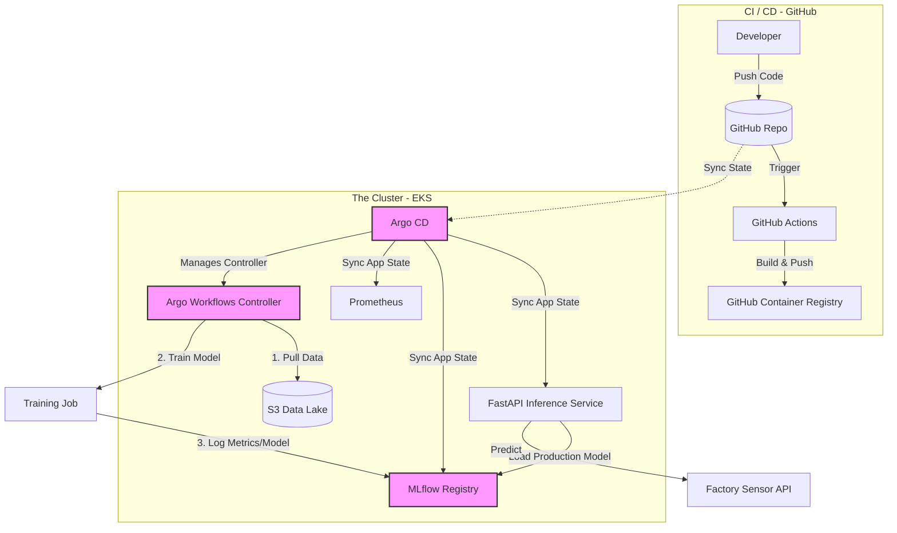

# 🛡️ CloudGuard Sentinel: Industrial MLOps Platform

**CloudGuard Sentinel** is an end-to-end MLOps platform designed for **Predictive Maintenance** in manufacturing. It predicts machine failures before they happen, preventing costly downtime.

Unlike typical "notebook" projects, this is a **production-grade platform** built with **GitOps** principles, **Infrastructure as Code**, and **Automated Model Governance**.

---

## 🏗️ High-Level Architecture



### The "Senior" Stack

| Component | Tool | Why I Chose It |
| :--- | :--- | :--- |
| **Infrastructure** | **Terraform (EKS)** | Reproducible infrastructure with secure IAM roles (IRSA). |
| **Deployment** | **Argo CD (GitOps)** | Prevents configuration drift. The cluster state always matches Git. |
| **Orchestration** | **Argo Workflows** | Scalable, container-native training pipelines (not just cron jobs). |
| **Model Registry** | **MLflow** | Centralized tracking for experiments and model versioning. |
| **Serving** | **FastAPI + Polling** | Zero-downtime model updates without restarting pods. |
| **Observability** | **Prometheus** | (Planned) Metrics exposed at `/metrics` for latency and drift monitoring. |

---

## 🚀 Key Features (The "Wow" Factors)

### 1. 🛡️ Champion/Challenger Model Evaluation
We don't just deploy models; we **compete** them.
* **The Logic:** When a new model is trained, the pipeline automatically compares its accuracy against the current `@Production` model.
* **The Safety Lock:** If the new model (Challenger) is worse, the pipeline **rejects the deployment**.
* **Evidence:**
    > "New model does not outperform the current production model. Not promoting." — *Pipeline Logs*

### 2. 🔄 True GitOps & Self-Healing
* Application deployment is decoupled from infrastructure.
* **Argo CD** constantly monitors the cluster. If a pod is deleted manually, Argo automatically heals the state.

### 3. 🔐 Enterprise Security (No Keys!)
* **OIDC & IRSA:** This project uses AWS IAM Roles for Service Accounts.
* **Zero Long-Lived Credentials:** No AWS Access Keys are hardcoded in the application or GitHub Secrets.

---

## 🛠️ How to Run This Project

### Prerequisites
* AWS CLI & Terraform installed.
* `kubectl` pointing to an EKS cluster.

### 1. Provision Infrastructure
```bash
cd infra/eks
terraform init
terraform apply -auto-approve
```

### 2. Deploy the GitOps Stack
```bash
# Deploy Argo CD & App of Apps
kubectl apply -f infra/gitops/cloudguard-stack.yaml
```

### 3. Trigger a Training Run
```bash
# Submit the Argo Workflow
kubectl create -f jobs/workflow.yaml
```

---

## 🔮 Future Roadmap (Production Readiness)
If this were running in a real factory, I would add:
1.  **Drift Detection:** Compare live inference data in S3 against training distributions.
2.  **Scalability:** Enable **Cluster Autoscaler** to handle training spikes (currently removed monitoring stack to optimize for cost/demo constraints).
3.  **A/B Testing:** Use **Argo Rollouts** to send 5% of traffic to the new model before full promotion.
